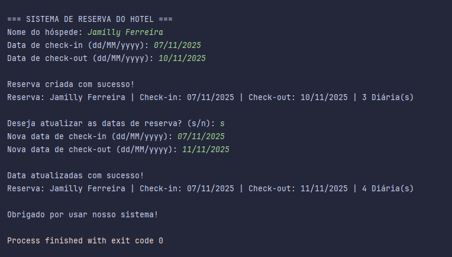

# Sistema de Reserva de Hotel 

Exercício de Java focado em **Orientação a Objetos** e **Tratamento de Exceções**.

---

## Descrição

Um projeto simples em Java feito via terminal para simular o processo de reserva de quartos de hotel, com validação de datas e tratamento de exceções personalizadas.

---

## Objetivos do Exercício
Esse exercício foi parte da minha prática de Java para reforçar:

- Criação e uso de **classes** e **objetos**
- Validação de dados e tratamento de erros com exceções;
- Como **controlar fluxo** de entrada de dados no terminal (`Scanner` + laços de repetição);
- Praticar exceções customizadas
- Organização de código em pacotes
- Boas práticas de OOP

---

## Como executar
1. Clone o repositório ou copie os arquivos para seu ambiente Java;
2. Compile o projeto
````bash

javac com/estudojava/exercicio/hotelreservation/application/Program.java
````
3. Execute
````bash

java com.estudojava.exercicio.hotelreservation.application.Program
````

---

## Conceitos praticados
- Orientação a Objetos (OO)
- Exceções customizadas (`InvalidDateException`, `InvalidReserveException`)
- LocalDate e DateTimeFormatter
- Try-catch-finally
- Validação de entrada do usuário
- Interação com o usuário via terminal.

---

## O que aprendi / revisei
- Como garantir que check-out não seja antes do check-in
- Como criar exceções customizadas (`InvalidDateException`, `InvalidReserveException`)
- Melhorar a leitura do código com mensagens claras e tratamento específico de erros
- Pensar no fluxo real de um sistema, onde o usuário pode errar e tentar novamente
- Como manter o código organizado e separado por responsabilidade.

---

## Tecnologias
- Java 21
- LocalDate API

## Exemplo de uso
